<div align="center">

# 🔐 GIA: Geometric Identity Authentication

<div align="center">


### **Authentication Based on Geometric Topology, Not Signals**

$$\boxed{\text{Identity} = \text{Topology}\big(\text{Reach}(X_0, U, t)\big)}$$

*Because you cannot fake what you cannot measure.*

-----

[](#)
[](https://www.linkedin.com/in/davarn-morrison-14b93b263)

**Inventor:** [Davarn Morrison](https://www.linkedin.com/in/davarn-morrison-14b93b263)  
**Patent Application:** GB2602013.1  
**Status:** Patent Pending (Filed January 2026)

</div>

-----

## 📘 Overview

**GIA (Geometric Identity Authentication)** is a novel authentication system that defines identity through **topological invariants** of a user’s reachable state-space, rather than through biometric signals, passwords, or behavioral patterns.

### **The Core Principle**

Traditional authentication methods rely on **signals** that can be observed, recorded, and reproduced:

- Passwords can be stolen
- Biometrics can be deepfaked
- Voices can be AI-cloned
- Behavioral patterns can be mimicked

**GIA uses geometry instead.**

By defining identity as the **topology of a reachable state manifold**, GIA creates authentication that is mathematically resistant to forgery, deepfakes, and synthetic reproduction.

-----

## 🎯 The Problem with Signal-Based Authentication

### **Why Traditional Methods Fail**

```mermaid
graph TB
    A[Traditional Authentication] --> B[Signal-Based]
    
    B --> C[Passwords]
    B --> D[Biometrics Face/Voice]
    B --> E[Behavioral Patterns]
    B --> F[2FA/OTP Codes]
    
    C --> G[❌ Can Be Stolen]
    D --> H[❌ Can Be Deepfaked]
    E --> I[❌ Can Be Mimicked]
    F --> J[❌ Can Be Intercepted]
    
    G --> K[Authentication Broken]
    H --> K
    I --> K
    J --> K
    
    style K fill:#e74c3c,stroke:#c0392b,stroke-width:4px
```



**The Fundamental Problem:**

All signal-based authentication assumes that **if you have the signal, you are the person**.

But in 2026:

- AI can clone any voice with 99.9% accuracy
- Deepfakes can reproduce any face in real-time
- Machine learning can mimic any behavioral pattern
- Passwords are routinely stolen via phishing

**Signals can be copied. Geometry cannot.**

-----

## 💡 The GIA Solution: Topology as Identity

### **Mathematical Definition**

$$\boxed{\text{Identity} = \text{Topology}\big(\text{Reach}(X_0, U, t)\big)}$$

**Where:**

<div align="center">

|Symbol             |Meaning               |Description                                               |
|-------------------|----------------------|----------------------------------------------------------|
|**X₀**             |Initial latent state  |The user’s underlying neural/cognitive structure          |
|**U**              |Admissible action set |All possible actions the user can take                    |
|**t**              |Evolution parameter   |Time or interaction steps                                 |
|**Reach(X₀, U, t)**|Reachable state set   |All states the user can occupy under natural interaction  |
|**Topology(·)**    |Topological invariants|Geometric structure: homology, Betti numbers, connectivity|

</div>

### **What This Means**

Identity is not **what you look like**, **what you sound like**, or **what you know**.

Identity is **the geometric shape of how you move through state-space**.

Two users are the same person **if and only if** their reachable state-space manifolds have **isomorphic topology**.

-----

## 🔬 How GIA Works

### **Authentication Process**

```mermaid
sequenceDiagram
    participant User
    participant GIA as GIA System
    participant Ref as Reference Topology
    
    User->>GIA: Interaction Data
    GIA->>GIA: 1. Extract State Samples
    GIA->>GIA: 2. Construct Reach(X₀, U, t)
    GIA->>GIA: 3. Compute Topology
    
    GIA->>Ref: 4. Compare to Stored Identity
    
    alt Topologies Match
        Ref-->>GIA: ✅ Isomorphic
        GIA-->>User: Authenticated
    else Topologies Differ
        Ref-->>GIA: ❌ Not Isomorphic
        GIA-->>User: Rejected
    end
```



### **Core Algorithm**

```python
def authenticate(observed_data, reference_identity):
    """
    GIA Authentication Algorithm
    """
    # Step 1: Acquire state samples from user interaction
    state_samples = extract_states(observed_data)
    
    # Step 2: Construct reachable set
    reachable_set = compute_reachable_set(state_samples)
    
    # Step 3: Extract topological invariants
    observed_topology = extract_topology(reachable_set)
    
    # Step 4: Compare to reference identity manifold
    reference_topology = reference_identity.topology
    
    # Step 5: Check topological equivalence
    if is_isomorphic(observed_topology, reference_topology):
        return AUTHENTICATED
    else:
        return REJECTED
```

### **Topological Invariants Extracted**

```python
def extract_topology(reachable_set):
    """
    Extract geometric invariants that define identity
    """
    topology = {
        # Algebraic topology
        'homology_groups': compute_homology(reachable_set),
        'betti_numbers': compute_betti_numbers(reachable_set),
        
        # Persistent homology
        'persistence_diagram': compute_persistence(reachable_set),
        
        # Connectivity structure
        'connectivity_graph': compute_connectivity(reachable_set),
        
        # Neighborhood structure
        'neighborhood_operator': compute_neighborhood(reachable_set)
    }
    
    return topology
```

-----

## 🛡️ Why Deepfakes Cannot Defeat GIA

### **The Mathematical Barrier**

```
╔═══════════════════════════════════════════════════════════════╗
║  WHY DEEPFAKES FAIL AGAINST GIA                              ║
╠═══════════════════════════════════════════════════════════════╣
║                                                               ║
║  What a deepfake can do:                                     ║
║    ✅ Reproduce your voice (signal)                          ║
║    ✅ Reproduce your face (appearance)                       ║
║    ✅ Mimic your typing pattern (surface behavior)           ║
║                                                               ║
║  What a deepfake CANNOT do:                                  ║
║    ❌ Infer your latent state X₀                             ║
║    ❌ Reconstruct your reachable manifold Reach(X₀, U, t)    ║
║    ❌ Match your topological invariants                      ║
║                                                               ║
║  Why not:                                                    ║
║    1. X₀ is unobservable (internal neural structure)         ║
║    2. Inferring X₀ from behavior is underdetermined          ║
║    3. Reach(X₀, U, t) is infinite-dimensional                ║
║    4. Topology cannot be faked without perfect X₀            ║
║                                                               ║
║  Result: INFORMATION-THEORETICALLY IMPOSSIBLE                ║
║                                                               ║
╚═══════════════════════════════════════════════════════════════╝
```

### **Attack Resistance Diagram**

```mermaid
graph TB
    A[Attacker Attempts Impersonation] --> B[Observes User Behavior]
    
    B --> C{Can Infer X₀?}
    
    C -->|Attempts| D[Inverse Problem:<br/>Infinite Solutions]
    D --> E[❌ UNDERDETERMINED]
    
    C -->|Attempts| F[Reconstruct Reach X₀, U, t]
    F --> G[Requires Infinite<br/>State Coverage]
    G --> H[❌ IMPOSSIBLE]
    
    C -->|Attempts| I[Match Topology]
    I --> J[Without X₀,<br/>Cannot Compute Topology]
    J --> K[❌ BLOCKED]
    
    E --> L[Attack Fails]
    H --> L
    K --> L
    
    L --> M[✅ GIA REJECTS IMPOSTER]
    
    style E fill:#e74c3c,stroke:#c0392b,stroke-width:3px
    style H fill:#e74c3c,stroke:#c0392b,stroke-width:3px
    style K fill:#e74c3c,stroke:#c0392b,stroke-width:3px
    style M fill:#2ecc71,stroke:#27ae60,stroke-width:4px
```



-----

## 📐 Mathematical Foundation

### **Formal Definition: Reachable Set**

Given:

- Initial state $X_0 \in \mathcal{S}$ (state space)
- Admissible actions $U$ (action space)
- Evolution parameter $t \in \mathbb{R}_+$

The **reachable set** is:

$$\text{Reach}(X_0, U, t) = {X \in \mathcal{S} \mid \exists u(\cdot) \in U, , X = \phi(t, X_0, u)}$$

Where $\phi$ is the flow map of the system dynamics.

### **Formal Definition: Identity Topology**

The **identity topology** is the topological structure extracted from the reachable set:

$$\mathcal{T}(X_0) = \text{Topology}\big(\text{Reach}(X_0, U, t)\big)$$

This includes:

- Homology groups $H_n(\text{Reach})$
- Betti numbers $\beta_n = \text{rank}(H_n)$
- Persistent homology diagrams
- Connectivity components

### **Authentication Criterion**

Two interaction traces belong to the same identity if and only if:

$$\text{Topology}(\text{Reach}(X_0, U, t)) \cong \text{Topology}(\text{Reach}(X_0’, U’, t’))$$

Where $\cong$ denotes topological isomorphism.

-----

## 🔧 Implementation

### **System Architecture**

```mermaid
graph TB
    A[User Interaction] --> B[State Acquisition Module]
    
    B --> C[Reachable Set Generator]
    C --> D[Topology Extraction Engine]
    
    D --> E[Topological Invariants]
    
    E --> F{Identity Equivalence Module}
    
    F --> G[Reference Identity M₀]
    
    F -->|Topology ≈ M₀| H[✅ AUTHENTICATED]
    F -->|Topology ≉ M₀| I[❌ REJECTED]
    
    style H fill:#2ecc71,stroke:#27ae60,stroke-width:3px
    style I fill:#e74c3c,stroke:#c0392b,stroke-width:3px
```



### **Reference Implementation (Pseudocode)**

```python
class GIASystem:
    """
    Geometric Identity Authentication System
    """
    
    def __init__(self):
        self.reference_identities = {}
    
    def enroll_user(self, user_id, interaction_data):
        """
        Enroll a new user by computing their identity topology
        """
        # Extract states from interaction
        states = self.extract_states(interaction_data)
        
        # Compute reachable set
        reach = self.compute_reachable_set(states)
        
        # Extract topology
        topology = self.extract_topology(reach)
        
        # Store as reference identity
        self.reference_identities[user_id] = topology
        
        return topology
    
    def authenticate(self, user_id, interaction_data):
        """
        Authenticate a user based on topological matching
        """
        # Get reference topology
        if user_id not in self.reference_identities:
            return False
        
        reference_topology = self.reference_identities[user_id]
        
        # Extract observed topology
        states = self.extract_states(interaction_data)
        reach = self.compute_reachable_set(states)
        observed_topology = self.extract_topology(reach)
        
        # Compare topologies
        similarity = self.compare_topologies(
            observed_topology, 
            reference_topology
        )
        
        # Authenticate if topologies are isomorphic
        threshold = 0.85  # Similarity threshold
        return similarity >= threshold
    
    def extract_states(self, interaction_data):
        """
        Extract state samples from user interaction
        """
        # Implementation depends on modality:
        # - Keystroke dynamics
        # - Mouse movements
        # - Touch gestures
        # - Voice patterns
        # - Behavioral sequences
        pass
    
    def compute_reachable_set(self, states):
        """
        Construct reachable set from state samples
        """
        reach = set()
        
        for state in states:
            # Estimate local dynamics
            neighbors = self.estimate_local_dynamics(state)
            reach.update(neighbors)
        
        # Return topological closure
        return self.closure(reach)
    
    def extract_topology(self, reach):
        """
        Extract topological invariants from reachable set
        """
        return {
            'homology': self.compute_homology(reach),
            'betti': self.compute_betti_numbers(reach),
            'persistence': self.compute_persistence(reach),
            'connectivity': self.compute_connectivity(reach),
            'neighborhood': self.compute_neighborhood(reach)
        }
    
    def compare_topologies(self, topology_1, topology_2):
        """
        Compute topological similarity (isomorphism test)
        """
        similarity = 0.0
        
        # Compare each invariant
        similarity += self.compare_homology(
            topology_1['homology'], 
            topology_2['homology']
        )
        similarity += self.compare_betti(
            topology_1['betti'], 
            topology_2['betti']
        )
        # ... additional comparisons
        
        # Normalize
        return similarity / num_invariants
```

-----

## 🎯 Use Cases

### **1. Financial Transactions**

- Bank account authentication
- Wire transfer verification
- Credit card authorization
- Cryptocurrency wallet access

### **2. Healthcare**

- Patient identity verification
- Electronic health record access
- Prescription authorization
- Medical device authentication

### **3. Government & Defense**

- Secure facility access
- Classified information systems
- Nuclear command authentication
- Voting system verification

### **4. AI & Autonomous Systems**

- AI agent identity verification
- Autonomous vehicle authorization
- Robot authentication
- Smart device access control

### **5. Enterprise Security**

- Corporate network access
- Cloud service authentication
- Developer account verification
- Privileged system access

-----

## 📄 Patent Information

**Patent Application:** GB2602013.1  
**Title:** System and Method for Geometric Identity Authentication (GIA™)  
**Applicant:** Davarn Morrison  
**Status:** Patent Pending  
**Filed:** January 2026

### **Patent Claims Summary**

The patent covers:

1. **Method Claims:**
- Authentication via topological invariants of reachable state sets
- Construction of identity manifolds from interaction data
- Topological comparison for identity verification
1. **System Claims:**
- State acquisition modules
- Reachable set generators
- Topology extraction engines
- Identity equivalence comparators
1. **Implementation Variants:**
- Sensorless authentication
- Multi-modal identity verification
- Neuromorphic implementations
- Quantum computing variants
- Distributed ledger embodiments

**Full patent specification available upon request for serious licensing inquiries.**

-----

## 🔬 Technical Validation

### **Experimental Proof**

Independent validation conducted by **Dr. Edinei Santin** (Physicist specializing in state-space dynamics and neuromorphic systems) demonstrated that:

1. ✅ Hallucinations in LLMs arise from **geometric instabilities** in latent manifolds
1. ✅ Topological constraints successfully prevent structural inconsistencies
1. ✅ The Morrison Invariant correctly predicts failure modes

**Report:** “Validating Geometric Failure Modes in Large Language Models” (January 9, 2026)

[Dr. Edinei Santin LinkedIn](https://www.linkedin.com/in/edineisantin)

-----

## 📚 Related Work

### **The Morrison Stack™**

GIA is part of a broader framework called **The Morrison Stack**, which includes:

1. **Morrison Law of Perception:**
   $$\text{Perception} = \text{Topology}\big(\mathcal{N}(X, I)\big)$$
   
   Defines perception as extraction of topological invariants from neighborhood structures.
1. **Morrison Law of Identity (GIA):**
   $$\text{Identity} = \text{Topology}\big(\text{Reach}(X_0, U, t)\big)$$
   
   Defines identity through reachable state topology.
1. **Morrison Safety Invariant:**
   $$\text{Safety} \Leftrightarrow \text{Reach}(s_0) \cap \Omega = \emptyset$$
   
   Guarantees safety by ensuring the system cannot reach forbidden states Ω.

**All components are patent-pending and available for licensing.**

-----

## 📞 Contact & Licensing

### **For Technical Inquiries:**

Questions about the mathematics, implementation, or technical feasibility of GIA.

### **For Licensing Inquiries:**

Organizations interested in implementing GIA for authentication systems.

### **For Research Collaboration:**

Academic institutions or research labs interested in topological authentication.

### **For Strategic Discussions:**

Enterprise or government entities requiring deepfake-resistant authentication.

-----

**Contact:**

**Davarn Morrison**  
Inventor, Geometric Identity Authentication (GIA™)  
Email: Davarn.trades@gmail.com  
LinkedIn: [linkedin.com/in/davarn-morrison-14b93b263](https://www.linkedin.com/in/davarn-morrison-14b93b263)

**Patent:** GB2602013.1 (Pending)

-----

<div align="center">

## 🔐 Authentication Through Geometry, Not Signals

$$\boxed{\text{Identity} = \text{Topology}\big(\text{Reach}(X_0, U, t)\big)}$$

**Because you cannot fake what you cannot measure.**  
**And you cannot measure what you cannot reach.**

-----


-----

[](https://www.linkedin.com/in/davarn-morrison-14b93b263)
[](mailto:Davarn.trades@gmail.com)

**© 2025-2026 Davarn Morrison — All Rights Reserved**

**Patent:** GB2602013.1 (Pending)

</div>
